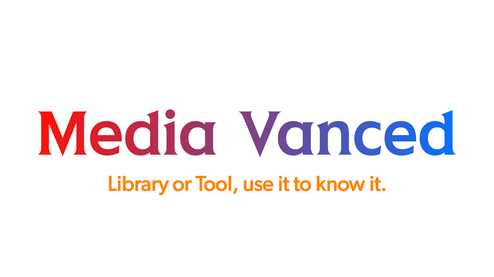

<p align="center">
  <a href="https://yogesh-hacker.github.io/yogesh-hacker/App/" target="_blank" rel="noopener noreferrer">
    
  </a>
</p>
<p align="center">

  
</p>

> Media Vanced is a sleek collection of Python scripts designed to effortlessly extract streaming or media links from various websites. Lightweight and blazing-fast, it can be seamlessly integrated as a library or used as a standalone tool. Its versatility extends across multiple programming languages. Experience its real-time prowess in the Hack Flix Android app. With support for numerous websites, Media Vanced redefines media accessibility. Discover more [here](https://yogesh-hacker.github.io/yogesh-hacker/App).
```console
~ $ python path_to_target_website_script.py
```
